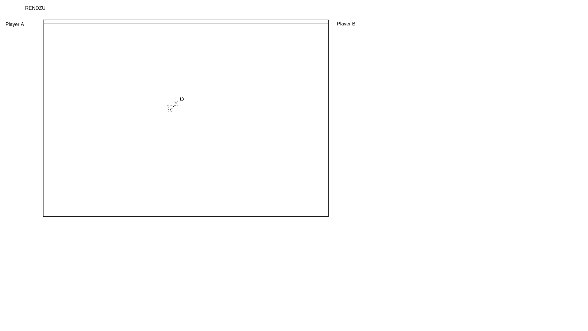

# 2026-rendzuBattle

Учебный проект курса Kotlin Backend Developer.

Rendzu Battle - это тестовый игровой проект на которой игроки создают комнаты для дуэлей, внутри которых происходит дуэль по правилам игры рендзю.
Задача проекта - развлекательная.

# Визуальная схема фронтенда

# Документация
- <a href="docs/targets.md">Целевая аудитория и портреты клиентов</a> 
- <a href="docs/mvp.md">Описание MVP</a> 
- <a href="docs/entities.md">Описание сущностей приложения</a> 

# Архитектурное виденье приложения
нарисовать в draw.io архитектурное видение приложения

